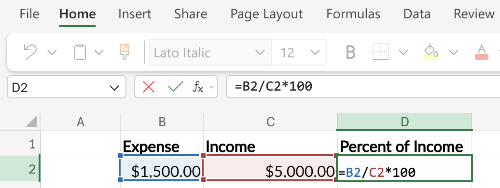
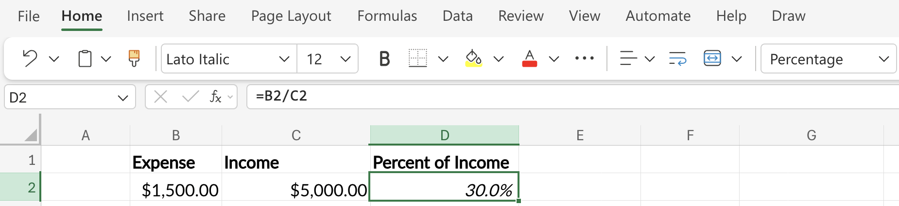
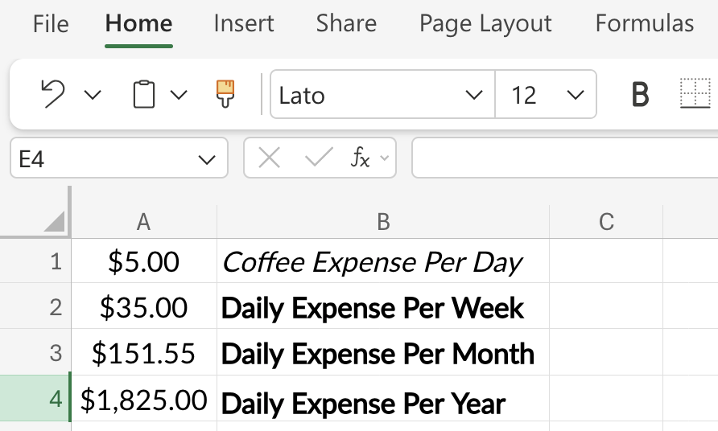
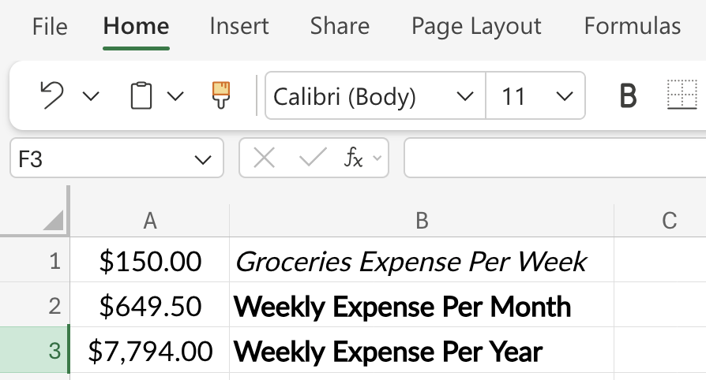
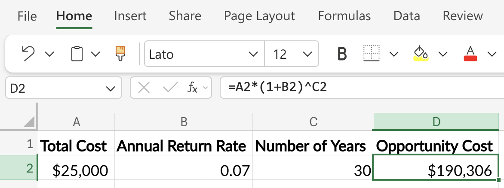
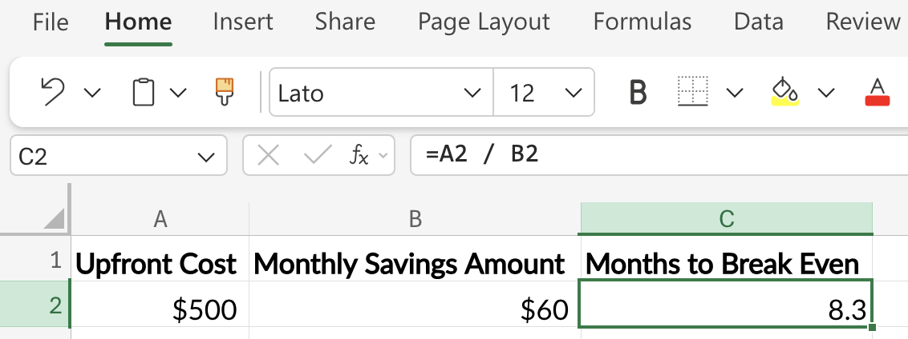

```{r}
#| label: setup-r
#| message: false
#| warning: false
#| include: false
source("_common.R")
```

```{python}
#| label: setup-py
#| include: false
def fmt_dollar(x, digits=2):
    return f"${x:,.{digits}f}"

def fmt_pct(x, digits=1):
    return f"{x * 100:.{digits}f}%"
```

## Book Topics

- **Mindset shift**: budgets are about *conscious allocation*, not restriction; "room for error" is the most underrated concept (Housel)
- **Expense categories**: fixed (predictable), variable (fluctuate), periodic (annual/irregular); each requires a different strategy
- **Sinking funds**: set aside 1/12 of annual periodic costs each month to avoid "budget emergencies"
- **Zero-based budgeting**: every dollar gets a job; income − all allocations = 0; best for rebuilding from debt
- **Percentage-based budgeting**: Sethi's Conscious Spending Plan (50–60% fixed, 10%+ investing, 20–35% guilt-free); low maintenance at steady income
- **Best tool**: the one you'll actually use; automatic imports, easy categorization, and a summary view matter most

## Percentages

The foundational budgeting calculation: what share of income does each expense represent?

**Formula:** (Expense ÷ Income) × 100

```{r}
#| label: pct-bar-model
#| echo: false
#| fig-cap: "Rent ($1,500) as a share of a $5,000 paycheck"
#| fig-asp: 0.25
library(ggplot2)
df_pct <- data.frame(
  label  = c("Rent\n$1,500", "Remaining\n$3,500"),
  amount = c(1500, 3500)
)
ggplot(df_pct, aes(x = "", y = amount, fill = label)) +
  geom_col(width = 0.5) +
  geom_text(aes(label = label), position = position_stack(vjust = 0.5),
            colour = "white", fontface = "bold", size = 4) +
  coord_flip() +
  scale_fill_manual(values = c("Rent\n$1,500" = "#f44242",
                               "Remaining\n$3,500" = "#0e9aa7")) +
  scale_y_continuous(labels = function(x) paste0("$", format(x, big.mark = ","))) +
  labs(x = NULL, y = "Monthly income ($5,000)") +
  theme_minimal(base_size = 12) +
  theme(legend.position = "none", axis.text.y = element_blank(),
        axis.ticks.y = element_blank(), panel.grid = element_blank())
```

::: panel-tabset

## R

We can create a simple function to calculate the percentage of income that an expense represents. The `fmt_pct()` function formats the result as a percentage.
```{r}
#| label: percent-r
percent_of_income <- function(expense, income) {
    fmt_pct(expense / income)
}
```

```{r}
#| label: percent-r-apply
percent_of_income(expense = 1500, income = 5000)
```

## Python

In Python, we store intermediate values explicitly before formatting; this makes the calculation steps transparent and easier to debug.

```{python}
#| label: percent-py
def percent_of_income(expense, income):
    ratio = expense / income
    return fmt_pct(ratio)

percent_of_income(expense=1500, income=5000)
```

## Excel

Assuming `Expense` is in cell `B2` and `Income` is in cell `C2`:

``` swift
=(B2 / C2) * 100
```

{width='100%' fig-align='center'}

Or, more simply, enter `=B2 / C2` and format the cell as a **Percentage** using the button in the toolbar.

{width='100%' fig-align='center'}

:::

## Annualizing and Monthly-izing

Scale any spending habit across time periods to see the true cost.

**Annual → Monthly:** ÷ 12 

**Monthly → Annual:** × 12 

**Weekly → Monthly:** × 4.33 

**Daily → Annual:** × 365

```{r}
#| label: annual-bar-model
#| echo: false
#| fig-cap: "The same $5/day habit across four time periods"
#| fig-asp: 0.50
library(ggplot2)
df_annual <- data.frame(
  period = factor(c("Daily\n($5)", "Weekly\n($35)", "Monthly\n($152)", "Annual\n($1,825)"),
                  levels = c("Daily\n($5)", "Weekly\n($35)", "Monthly\n($152)", "Annual\n($1,825)")),
  cost = c(5, 35, 152, 1825),
  fill = c("#86ddcd", "#0e9aa7", "#48a56a", "#f44242")
)
ggplot(df_annual, aes(x = period, y = cost, fill = period)) +
  geom_col(width = 0.6) +
  geom_text(aes(label = paste0("$", cost)), vjust = -0.4, fontface = "bold", size = 4) +
  scale_fill_manual(values = setNames(df_annual$fill, as.character(df_annual$period))) +
  scale_y_continuous(limits = c(0, 2100), labels = function(x) paste0("$", x)) +
  labs(x = NULL, y = NULL) +
  theme_minimal(base_size = 12) +
  theme(legend.position = "none", panel.grid.major.x = element_blank(),
        panel.grid.minor = element_blank())
```

::: panel-tabset

## R

Two of the most common conversions are annualizing daily, weekly, and  monthly amounts and converting annual, weekly, or daily amounts to a monthly equivalent. 

```{r}
#| label: to_annual-r
#| code-fold: false
to_annual <- function(amount, period = c("daily", "weekly", "monthly")) {
  period  <- match.arg(period)
  factors <- c(daily = 365, weekly = 52, monthly = 12)
  fmt_dollar(amount * factors[[period]])
}
```

```{r}
#| label: to_monthly-r
#| code-fold: false
to_monthly <- function(amount, period = c("daily", "weekly", "annual")) {
  period  <- match.arg(period)
  factors <- c(daily = 30.44, weekly = 4.33, annual = 1 / 12)
  fmt_dollar(amount * factors[[period]])
}
```

```{r}
#| label: to_annual-r-apply
#| code-fold: false
to_annual(amount = 5, period = "daily")
```

```{r}
#| label: to_monthly-r-apply
#| code-fold: false
to_monthly(amount = 150, period = "weekly")
```

## Python

```{python}
#| label: annualize-py
#| code-fold: false
def to_annual(amount, period="daily"):
    factors = {"daily": 365, "weekly": 52, "monthly": 12}
    return fmt_dollar(amount * factors[period])
```

```{python}
#| label: monthlyize-py
#| code-fold: false
def to_monthly(amount, period="daily"):
    factors = {"daily": 30.44, "weekly": 4.33, "annual": 1 / 12}
    return fmt_dollar(amount * factors[period])
```

```{python}
#| label: annualize-py-apply
#| code-fold: false
print(to_annual(amount=5, period="daily"))
```

```{python}
#| label: monthlyize-py-apply
#| code-fold: false
print(to_monthly(amount=150, period="weekly"))
```

## Excel

Let's start with the daily value in cell `A1`, then convert it to the cost per week in cell `A2`:

``` swift
=A1 * 7
```

Next we can convert the week to the monthly cost in cell `A3`:

``` swift
=A2 * 4.33
```

Finally, we get the annual cost in cell `A4`:

``` swift
=A1 * 365
```

Format cells `A1` - `A4` as **Currency** or **Accounting**.

{width='100%' fig-align='center'}

To convert a weekly value in cell `A1` to a monthly value, place the following formula in cell `A2`:

``` swift
=A1 * 4.33
```

To convert the monthly cost to an annual cost, enter the following in cell `A3`:

``` swift
=A2 * 12
```

Format cells `A1` - `A3` as **Currency** or **Accounting**.

{width='100%' fig-align='center'}

:::

## Opportunity Cost

Every dollar spent is also what that dollar could have become. The hidden cost of any purchase is its future value if invested instead.

**Formula:** amount × (1 + r)\^n

```{r}
#| label: opp-cost-bar-model
#| echo: false
#| fig-cap: "$25,000 invested at 7% — value at each checkpoint"
#| fig-asp: 0.50
library(ggplot2)
yrs  <- c(0, 5, 10, 20, 30)
vals <- round(25000 * (1.07)^yrs)
df_opp <- data.frame(
  year  = factor(paste0("Year ", yrs), levels = paste0("Year ", yrs)),
  value = vals
)
ggplot(df_opp, aes(x = year, y = value)) +
  geom_col(fill = "#0e9aa7", width = 0.6) +
  geom_text(aes(label = paste0("$", formatC(value, format = "d", big.mark = ","))),
            vjust = -0.4, fontface = "bold", size = 3.5) +
  scale_y_continuous(limits = c(0, max(vals) * 1.18),
                     labels = function(x) paste0("$", round(x / 1000), "k")) +
  labs(x = NULL, y = NULL) +
  theme_minimal(base_size = 12) +
  theme(panel.grid.major.x = element_blank(), panel.grid.minor = element_blank())
```

::: panel-tabset
## R

```{r}
#| label: opp-cost-r
opportunity_cost <- function(amount, rate, years) {
  (amount * (1 + rate)^years) |>
    fmt_dollar()
}
```

```{r}
#| label: opp-cost-r-apply
opportunity_cost(amount = 25000, rate = 0.07, years = 30)
```

## Python

In Python, we store intermediate values explicitly before formatting; this makes the calculation steps transparent and easier to debug.

```{python}
#| label: opp-cost-py
def opportunity_cost(amount, rate, years):
    fv = amount * (1 + rate) ** years
    return fmt_dollar(fv)
```

```{python}
#| label: opp-cost-py-apply
opportunity_cost(amount=25000, rate=0.07, years=30)
```

## Excel

Assuming the initial amount is in cell `A2`, the annual rate (as a decimal, e.g., 0.07) is in `B2`, and the number of years is in `C2`:

``` swift
=A2*(1+B2)^C2
```

{width='100%' fig-align='center'}

:::

## Break-Even

Useful for evaluating memberships, refinances, or any purchase with an upfront cost and recurring savings.

**Formula:** Upfront Cost ÷ Monthly Savings = months to break even

```{r}
#| label: break-even-bar-model
#| echo: false
#| fig-cap: "$60/month savings accumulating toward a $500 upfront cost"
#| fig-asp: 0.50
library(ggplot2)
months <- 1:10
df_be  <- data.frame(month = factor(paste0("Mo ", months), levels = paste0("Mo ", months)),
                     saved = months * 60)
df_be$reached <- df_be$saved >= 500
ggplot(df_be, aes(x = month, y = saved, fill = reached)) +
  geom_col(width = 0.65) +
  geom_hline(yintercept = 500, colour = "#f44242", linewidth = 1, linetype = "dashed") +
  annotate("text", x = 5.5, y = 520, label = "Upfront cost: $500",
           colour = "#f44242", fontface = "bold", size = 3.5) +
  scale_fill_manual(values = c("FALSE" = "#0e9aa7", "TRUE" = "#48a56a")) +
  scale_y_continuous(labels = function(x) paste0("$", x)) +
  labs(x = NULL, y = "Cumulative savings") +
  theme_minimal(base_size = 12) +
  theme(legend.position = "none", panel.grid.major.x = element_blank(),
        panel.grid.minor = element_blank())
```

::: panel-tabset
## R

```{r}
#| label: break-even-r
#| code-fold: false
months_to_break_even <- function(upfront_cost, monthly_savings) {
  upfront_cost / monthly_savings
}
```

```{r}
#| label: break-even-r-apply
#| code-fold: false
months_to_break_even(upfront_cost = 500, monthly_savings = 60)
```

## Python

```{python}
#| label: break-even-py
#| code-fold: false
def months_to_break_even(upfront_cost, monthly_savings):
    return upfront_cost / monthly_savings
```

```{python}
#| label: break-even-py-apply
#| code-fold: false
months_to_break_even(upfront_cost=500, monthly_savings=60)
```

## Excel

Assuming the upfront cost is in cell `A2` and the monthly savings amount is in cell `B2`:

``` swift
=A2 / B2
```

{width='100%' fig-align='center'}
:::
