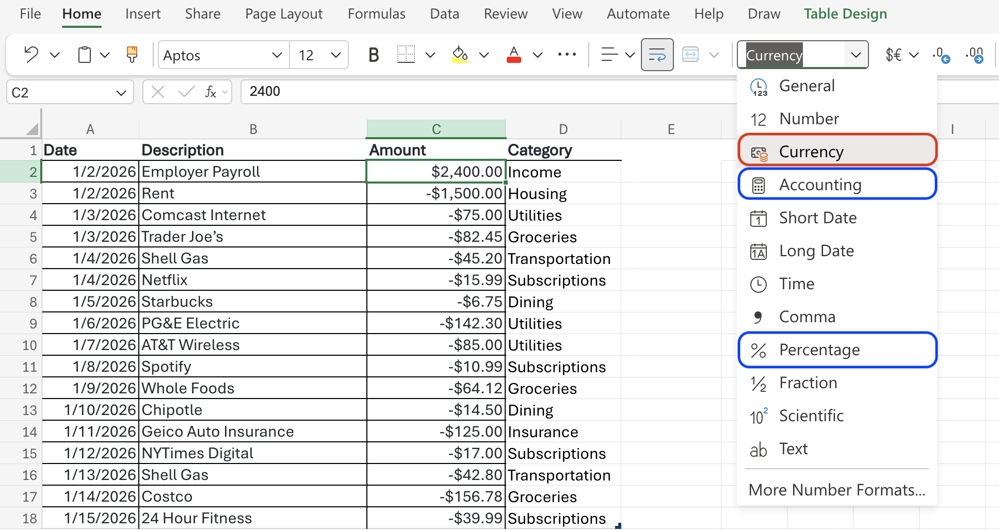
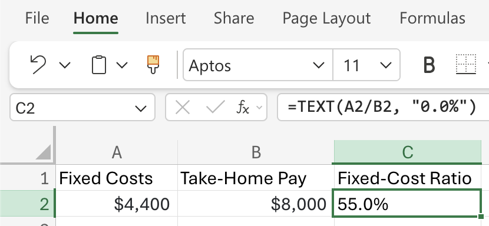
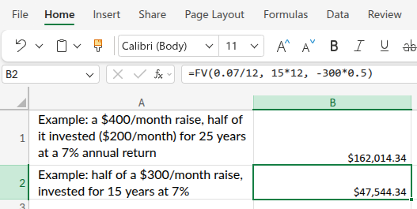

```{r}
#| label: setup-r
#| message: false
#| warning: false
#| include: false
library(tidyverse)
reticulate::py_require(c("numpy", "polars"))
```

```{python}
#| label: setup-py
#| include: false
import polars as pl
import numpy as np
```

## Math for Income {#math-for-income}

The [income](https://mjfrigaard.github.io/fm-finance/income.html) chapter is mostly about behavior, but it also introduces some math and how to write R/Python functions.

### Functions {.unnumbered}

Functions perform operations: calculate a total, build a table, create a graph, etc. The function's *arguments* are the inputs it needs to do its job, and the *output* is what it gives back. For example, the `sum()` function takes a list of numbers as an argument and outputs their total.

In R, functions are defined using the `function()` keyword,

``` r
my_fun <- function() {
  # function body
}
```

In Python, you use `def`:

``` python
def my_fun():
    # function body
```

Both languages allow you to create your own functions to perform specific tasks, which is especially useful for financial calculations.

### Number formatting {.unnumbered}

Before working through any calculations, it helps to have a few small functions that handle the `$` and `%` symbols you'll see throughout this book. We'll call these *formatting utilities*: they take a bare number and return a reader-friendly string.

::: panel-tabset

## R

`fmt_dollar()` adds a dollar sign, comma separators for thousands, and rounds to a given number of decimal places:

```{r}
#| label: fmt-dollar-r
fmt_dollar <- function(x, digits = 2) {
  paste0("$", formatC(x, format = "f", digits = digits, big.mark = ","))
}
```

`fmt_pct()` expects a decimal rate (e.g., `0.07` for 7%) and converts it to a percentage string:

```{r}
#| label: fmt-pct-r
fmt_pct <- function(x, digits = 1) {
  paste0(round(x * 100, digits), "%")
}
```

```{r}
#| label: fmt-utils-r-apply
fmt_dollar(9200)
fmt_dollar(4200.50)
fmt_pct(0.07)
fmt_pct(0.456)
```

## Python

`fmt_dollar()` uses an [f-string](https://docs.python.org/3/tutorial/inputoutput.html#formatted-string-literals) with `,` for thousands and `.{digits}f` for decimal places:

```{python}
#| label: fmt-dollar-py
def fmt_dollar(x, digits=2):
    return f"${x:,.{digits}f}"
```

`fmt_pct()` also takes a decimal rate and multiplies by 100 before formatting:

```{python}
#| label: fmt-pct-py
def fmt_pct(x, digits=1):
    return f"{x * 100:.{digits}f}%"
```

```{python}
#| label: fmt-utils-py-apply
print(fmt_dollar(9200))
print(fmt_dollar(4200.50))
print(fmt_pct(0.07))
print(fmt_pct(0.456))
```

## Excel 

In Excel, number formatting can be done with the tools in the toolbar. Just select the cells you'd to format and select the appropriate option from the dropdown.

{width='100%' fig-align="center"}

Note there are two options for money (currency and accounting).[^excel-formats]

:::

[^excel-formats]: Read more about the [differences between currency and accounting](https://support.microsoft.com/en-us/excel/format-numbers-as-currency-in-excel#__toc305071612) formats in Excel. 

Both `fmt_dollar()` and `fmt_pct()` follow the same convention: input is always a plain number, output is always a string. You'll see them used to clean up results throughout this chapter.

### The Fixed-Cost Ratio {.unnumbered}

Fixed costs are things like rent, loan payments, insurance, and utilities. They are considered *fixed* because they don't really change month to month.

A good benchmark is to keep them under \~60% of your income/take-home pay (leaving about 40% for *variable* costs and savings).

**Formula:** Fixed-Cost Ratio = Fixed Costs ÷ Take-Home Pay × 100

::: panel-tabset

## R

```{r}
#| label: fixed-cost-r
fixed_cost_ratio <- function(fixed_costs, take_home) {
  fixed_costs / take_home
}
```

Now we can apply the function to \$4,200 of fixed costs on \$9,200 take-home pay. The result is a decimal, so we pipe it into `fmt_pct()` to format it as a percentage string:

```{r}
#| label: fixed-cost-r-apply
fixed_cost_ratio(fixed_costs = 4200, take_home = 9200) |> fmt_pct()
```

#### Pipes in R {.unnumbered}

The pipe operator (`|>`) allows you to take the output of one function and use it as the input for another function, making your code more readable and efficient. Read more in the [Pipe Operator](r_vs_py.qmd#sec-pipe-operator) section of R vs. Python.

In the example above, we pipe the raw ratio into `fmt_pct()` to produce the percentage string. A better way to do this is to wrap both steps in a single function:

```{r}
#| label: fixed-cost-r-pipe
fixed_cost_ratio_pct <- function(fixed_costs, take_home) {
  fixed_cost_ratio(fixed_costs, take_home) |> fmt_pct()
}
```

```{r}
#| label: fixed-cost-r-pipe-apply
fixed_cost_ratio_pct(fixed_costs = 4200, take_home = 9200)
```

## Python

In Python, we can define the same function without needing a pipe operator, since we can directly return the rounded and properly formatted string:

```{python}
#| label: fixed-cost-py
def fixed_cost_ratio(fixed_costs, take_home):
    ratio = (fixed_costs / take_home) * 100
    return f"{ratio:.1f}%"
```

Apply our Python function to \$4,200 of fixed costs on \$9,200 take-home

```{python}
#| label: fixed-cost-py-apply
fixed_cost_ratio(fixed_costs=4200, take_home=9200)
```

Note the differences in using `paste0()` in R vs. [f-strings in Python](https://docs.python.org/3/tutorial/inputoutput.html#formatted-string-literals) for formatting the output as a percentage string. Read more about string formatting in [String Formatting](r_vs_py.qmd#sec-string-formatting).

## Excel

In Excel there's no function: we just put the numbers in cells and write the formula once. Enter the fixed costs in cell **A2** and take-home pay in **B2**, then in **C2**:

```swift
=A2/B2
```

That gives the ratio as decimal, but we can format **C2** as a percentage using **Home → %**, or **Ctrl+Shift+5**.

To produce the percent *string* directly (the analog of R's `paste0(..., "%")` and Python's f-string), use `TEXT()` instead:

```swift
=TEXT(A2/B2, "0.00%")
```

Below is the example from the text, showing the fixed-cost ratio as a percentage string:

{width="75%"}


:::

### What a Raise Is Really Worth {.unnumbered}

In the [Income](https://mjfrigaard.github.io/fm-finance/income.html) chapter, we saw that "Split the raise" (i.e., put half of your monthly raise into the market for a few decades) is a powerful strategy for building wealth. But how powerful? Let's put some numbers to it.

**Formula:** FV = PMT × \[((1 + r)\^n − 1) ÷ r\]

- PMT is the amount invested each month  
- *r* is the monthly return  
- *n* is the number of months.

This is the future-value-of-contributions formula we revisit in [Investing Basics](https://mjfrigaard.github.io/fm-finance/investing_basics.html). 

::: panel-tabset

## R

```{r}
#| label: raise-value-r
raise_invested_value <- function(monthly_raise, invest_share, rate, years) {
  contribution <- monthly_raise * invest_share
  monthly_rate <- rate / 12
  periods      <- years * 12
  contribution * (((1 + monthly_rate)^periods - 1) / monthly_rate)
}
```

Let's see what happens when we take half of a $300/month raise, invested for 15 years at 7%:

```{r}
#| label: raise-value-r-apply
raise_invested_value(monthly_raise = 300, invest_share = 0.5, rate = 0.07, years = 15) |>
  fmt_dollar()
```

## Python

```{python}
#| label: raise-value-py
def raise_invested_value(monthly_raise, invest_share, rate, years):
    contribution = monthly_raise * invest_share
    monthly_rate = rate / 12
    periods = years * 12
    return contribution * (((1 + monthly_rate) ** periods - 1) / monthly_rate)
```

Half of a $300/month raise, invested for 15 years at 7%

```{python}
#| label: raise-value-py-apply
raise_invested_value(monthly_raise=300, invest_share=0.5, rate=0.07, years=15)
```

## Excel

Excel's built-in [**`FV()`** (future value) function's](https://support.microsoft.com/en-US/Excel/fv-function) arguments are `FV(rate, nper, pmt)`:

- `rate` is the return *per period* (monthly here): `7%/12`
- `nper` is the number of periods: `15*12`
- `pmt` is the amount invested each period, entered as a *negative* number because it's cash leaving your pocket: `-150` (half of $300) or `-300*0.5`

Half of a $300/month raise, invested for 15 years at 7%

```swift
=FV(0.07/12, 15*12, -300*0.5)
```

{width="75%" fig-align='center'}

:::