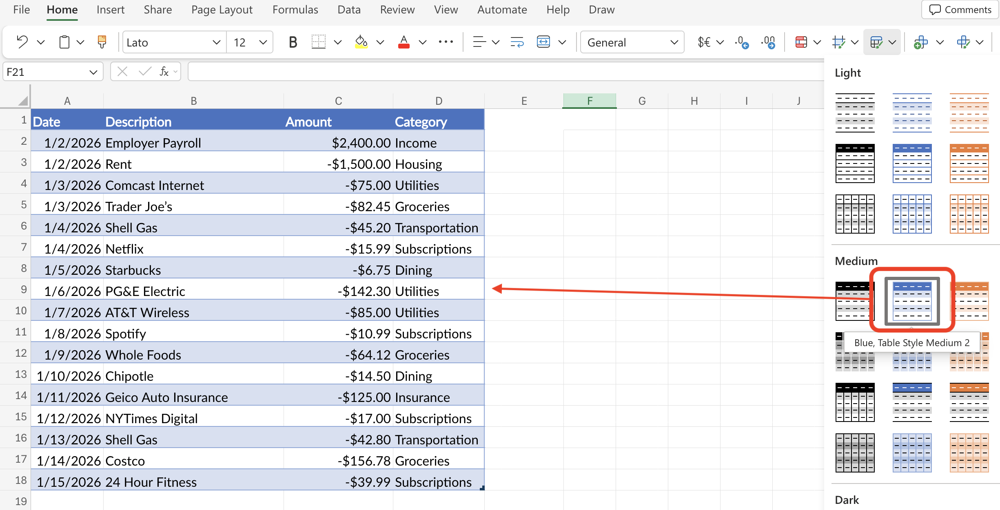
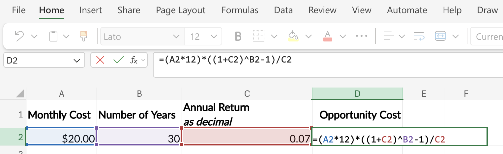
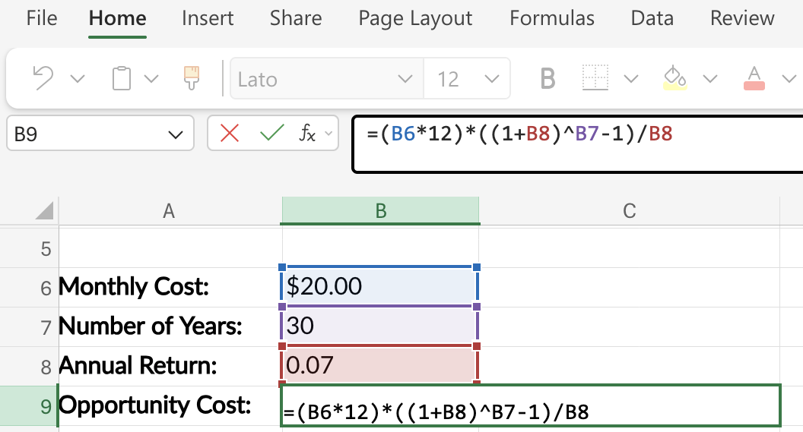
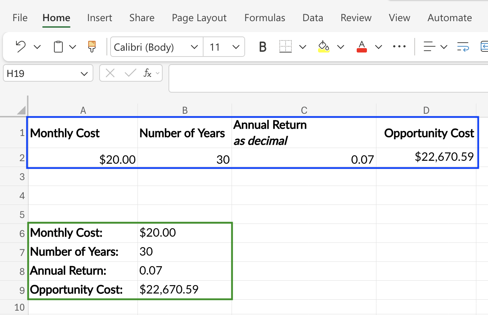

```{r}
#| label: setup-r
#| message: false
#| warning: false
#| include: false
source("_common.R")
```

```{python}
#| label: setup-py
#| include: false
import polars as pl
pl.Config.set_tbl_rows(20)

def fmt_dollar(x, digits=2):
    return f"${x:,.{digits}f}"

def fmt_pct(x, digits=1):
    return f"{x * 100:.{digits}f}%"
```

## Book Topics

- **Capture methods**: spending journal, checkbook register, cash envelopes, bank statements; pick one and run it for a full month
- **Bank statement exports**: `Date`, `Description`, `Amount` columns; you add the `Category`
- **Categorization**: 6–10 stable buckets; use "Other" when in doubt; only promote a new category after seeing it 3 months running
- **Monthly review**: pull statements → categorize → compare to budget → pick *one* change; repeat 12× per year
- **Subscriptions**: average household spends $200–$300/month without realizing it; audit every 90 days

## Bank Statement Data

A minimal bank export has three columns: `Date`, `Description`, and `Amount`. The code blocks below show how to create an example bank statement file in R, Python, and Excel. 

::: panel-tabset

## R

```{r}
#| label: bank-statement-r
r_bank_statement <- tibble::tibble(
  Date = as.Date(c(
    "2026-01-02", "2026-01-02", "2026-01-03", "2026-01-03",
    "2026-01-04", "2026-01-04", "2026-01-05", "2026-01-06",
    "2026-01-07", "2026-01-08", "2026-01-09", "2026-01-10",
    "2026-01-11", "2026-01-12", "2026-01-13", "2026-01-14",
    "2026-01-15"
  )),
  Description = c(
    "Employer Payroll", "Rent", "Comcast Internet", "Trader Joe's",
    "Shell Gas", "Netflix", "Starbucks", "PG&E Electric",
    "AT&T Wireless", "Spotify", "Whole Foods", "Chipotle",
    "Geico Auto Insurance", "NYTimes Digital", "Shell Gas", "Costco",
    "24 Hour Fitness"
  ),
  Amount = c(
     2400.00, -1500.00, -75.00, -82.45, -45.20, -15.99, -6.75,
    -142.30, -85.00, -10.99, -64.12, -14.50, -125.00, -17.00,
     -42.80, -156.78, -39.99
  )
)

r_bank_statement |> knitr::kable()
```

We can view the bank statement in R using `knitr::kable()`.

## Python

In Python, we'll use `polars` to create a `DataFrame` and display the bank statement. This is similar to the `tibble` we created above. 

```{python}
#| label: bank-statement-py
import polars as pl

py_bank_statement = pl.DataFrame({
    "Date": [
        "2026-01-02", "2026-01-02", "2026-01-03", "2026-01-03",
        "2026-01-04", "2026-01-04", "2026-01-05", "2026-01-06",
        "2026-01-07", "2026-01-08", "2026-01-09", "2026-01-10",
        "2026-01-11", "2026-01-12", "2026-01-13", "2026-01-14",
        "2026-01-15"
    ],
    "Description": [
        "Employer Payroll", "Rent", "Comcast Internet", "Trader Joe's",
        "Shell Gas", "Netflix", "Starbucks", "PG&E Electric",
        "AT&T Wireless", "Spotify", "Whole Foods", "Chipotle",
        "Geico Auto Insurance", "NYTimes Digital", "Shell Gas", "Costco",
        "24 Hour Fitness"
    ],
    "Amount": [
         2400.00, -1500.00, -75.00, -82.45, -45.20, -15.99, -6.75,
        -142.30, -85.00, -10.99, -64.12, -14.50, -125.00, -17.00,
         -42.80, -156.78, -39.99
    ]
}).with_columns(pl.col("Date").str.to_date())

py_bank_statement
```

## Excel

We can simply copy and paste the data into Excel; `Date` in A, `Description` in B, `Amount` in C.

{width='75%' fig-align='center'}


:::

## Categorizing Transactions

Map description keywords to budget buckets in a single pass.

::: panel-tabset

## R

In R, we can use `dplyr` to do the following:

- `dplyr::case_when()` evaluates each pattern in order and assigns the matching category

  - `grepl()` does the keyword test against `Description`

- The final `TRUE` arm catches everything that didn't match and labels it `"Other"`
```{r}
#| label: categorize-r
r_bank_statement <- r_bank_statement |>
  dplyr::mutate(
    Category = dplyr::case_when(
      grepl("Payroll", Description) ~ "Income",
      grepl("Rent", Description) ~ "Housing",
      grepl("Comcast|PG&E|AT&T", Description) ~ "Utilities",
      grepl("Trader Joe|Whole Foods|Costco", Description) ~ "Groceries",
      grepl("Shell", Description) ~ "Transportation",
      grepl("Starbucks|Chipotle", Description) ~ "Dining",
      grepl("Netflix|Spotify|NYTimes|24 Hour Fitness", Description) ~ "Subscriptions",
      grepl("Geico", Description) ~ "Insurance",
      TRUE ~ "Other"
    )
  )

r_bank_statement |> 
  knitr::kable()
```

## Python

`polars` is similar to `dplyr`, but:

- `with_columns()` is the `mutate()` analog

  - a chain of `pl.when().then()` calls is the `case_when()` analog

- `pl.col("Description").str.contains(...)` does the keyword test

  - regex by default and the `|` between merchants is alternation

```{python}
#| label: categorize-py
py_bank_statement = py_bank_statement.with_columns(
    Category = pl.when(pl.col("Description").str.contains("Payroll")).then(pl.lit("Income"))
        .when(pl.col("Description").str.contains("Rent")).then(pl.lit("Housing"))
        .when(pl.col("Description").str.contains("Comcast|PG&E|AT&T")).then(pl.lit("Utilities"))
        .when(pl.col("Description").str.contains("Trader Joe|Whole Foods|Costco")).then(pl.lit("Groceries"))
        .when(pl.col("Description").str.contains("Shell")).then(pl.lit("Transportation"))
        .when(pl.col("Description").str.contains("Starbucks|Chipotle")).then(pl.lit("Dining"))
        .when(pl.col("Description").str.contains("Netflix|Spotify|NYTimes|24 Hour Fitness")).then(pl.lit("Subscriptions"))
        .when(pl.col("Description").str.contains("Geico")).then(pl.lit("Insurance"))
        .otherwise(pl.lit("Other"))
)

py_bank_statement
```

## Excel

In Excel, the [`IFS()` function](https://support.microsoft.com/en-US/Excel/IFS-function) is the direct analog of `case_when()`/`when().then()`. 

- `IFS()` takes a list of conditions and corresponding values, evaluated top to bottom, with the first match winning

- `SEARCH()` returns the position of a keyword in a cell (or `#VALUE!` if not found)

- Wrapping it in `ISNUMBER()` turns that into a true/false test

  - For categories with several rows/transactions, wrap the tests in `OR()`

- The final `TRUE, "Other"` arm is the equivalent of `dplyr`'s `TRUE ~ "Other"` and `polars`'s `.otherwise(...)`; it catches anything that didn't match an earlier pattern.

```swift
=IFS(
  ISNUMBER(SEARCH("Payroll",B2)), "Income",
  ISNUMBER(SEARCH("Rent",B2)), "Housing",
  OR(ISNUMBER(SEARCH("Comcast",B2)),ISNUMBER(SEARCH("PG&E",B2)),ISNUMBER(SEARCH("AT&T",B2))), "Utilities",
  OR(ISNUMBER(SEARCH("Trader Joe",B2)),ISNUMBER(SEARCH("Whole Foods",B2)),ISNUMBER(SEARCH("Costco",B2))), "Groceries",
  ISNUMBER(SEARCH("Shell",B2)), "Transportation",
  OR(ISNUMBER(SEARCH("Starbucks",B2)),ISNUMBER(SEARCH("Chipotle",B2))), "Dining",
  OR(ISNUMBER(SEARCH("Netflix",B2)),ISNUMBER(SEARCH("Spotify",B2)),ISNUMBER(SEARCH("NYTimes",B2)),ISNUMBER(SEARCH("24 Hour Fitness",B2))), "Subscriptions",
  ISNUMBER(SEARCH("Geico",B2)), "Insurance",
  TRUE, "Other"
)
```

If the statement is laid out with `Date` in column `A`, `Description` in column `B`, and `Amount` in column `C`, type `Category` in cell `D1`, then paste the formula below into `D2`:

{width='100%' fig-align='center'}

Then copy `D2` down through every transaction row (select `D2`, double-click the small square in the bottom-right corner, or use `Ctrl+D` after selecting `D2:D{last_row}`).

* To add a new merchant when one shows up: edit the formula in `D2`, then re-fill down. Keep the new merchant near the bottom of its category group so the existing patterns still resolve first.

In Excel, we can also use the *Format as Table* feature to make the data easier to read.[^excel-tables] You can select a color/style for your table and it will automatically update the data. 

{width='100%' fig-align='center'}

[^excel-tables]: Read the [Overview of Excel tables](https://support.microsoft.com/en-us/excel/overview-of-excel-tables) on the Microsoft documentation. 

:::

## Subscription Opportunity Cost

A small recurring subscription has a large long-run cost when you account for what the money could have earned.

**Formula:** Monthly Cost × 12 × ((1 + r)\^n − 1) ÷ r

```{r}
#| label: subscription-bar-model
#| echo: false
#| fig-cap: "Future value of a $20/month subscription's annual cost if invested at 7%"
#| fig-asp: 0.50
library(ggplot2)
years <- c(0, 5, 10, 20, 30)
values <- c(240, 240 * ((1.07^5  - 1) / 0.07), 240 * ((1.07^10 - 1) / 0.07),
            240 * ((1.07^20 - 1) / 0.07), 240 * ((1.07^30 - 1) / 0.07))
df_sub <- data.frame(
  year  = factor(paste0("Year ", years), levels = paste0("Year ", years)),
  value = values,
  fill  = c(rep("#0e9aa7", 4), "#f44242")
)
ggplot(df_sub, aes(x = year, y = value, fill = fill)) +
  geom_col(width = 0.6, colour = "#1C1C1E", linewidth = 0.4) +
  geom_text(aes(label = paste0("$", formatC(round(value), format = "d", big.mark = ","))),
            vjust = -0.4, fontface = "bold", size = 3.5, colour = "#1C1C1E") +
  scale_fill_identity() +
  scale_y_continuous(labels = function(x) paste0("$", formatC(x, format = "d", big.mark = ",")),
                     expand = expansion(mult = c(0, 0.12))) +
  labs(x = "Checkpoint", y = "Accumulated value (7% annual return)") +
  theme_minimal(base_size = 12) +
  theme(panel.grid.major.x = element_blank(), panel.grid.minor = element_blank())
```

::: panel-tabset

## R

Note the rate is given as a decimal and the order of operations. 
```{r}
#| label: subscription-opp-cost-r
subscription_opportunity_cost <- function(monthly_cost, years, rate = 0.07) {
  annual_cost <- monthly_cost * 12
  op_cost <- (annual_cost * ((1 + rate)^years - 1) / rate)
  fmt_dollar(op_cost)
}
```

```{r}
#| label: subscription-opp-cost-r-apply
subscription_opportunity_cost(monthly_cost = 20, years = 30)
```

## Python

Note the exponential is indicated with `**` (not `^`). In Python, we store intermediate values explicitly before formatting; this makes the calculation steps transparent and easier to debug.

```{python}
#| label: subscription-opp-cost-py
def subscription_opportunity_cost(monthly_cost, years, rate=0.07):
    annual_cost = monthly_cost * 12
    op_cost = annual_cost * ((1 + rate) ** years - 1) / rate
    return fmt_dollar(op_cost) # format the result as a dollar amount
```

```{python}
#| label: subscription-opp-cost-py-apply
subscription_opportunity_cost(monthly_cost=20, years=30)
```

## Excel

In Excel, create a new sheet with the inputs: 

| Monthly cost | Number of Years | Annual Return (as decimal) | Opportunity Cost |
| ------------ | --------------- | -------------------------- | ---------------- |
| $20          | 30              | 0.07                       | *Formula below*  |

The formula (given this setup) is below:

```swift
=(A2*12)*((1+C2)^B2-1)/C2
```

`A2*12` converts the monthly cost to annual; the rest is the future-value-of-an-annuity formula using the rate in `C2` and the horizon in `B2`. The formula (given this setup) is below:

{width='100%' fig-align='center'}

Note that if we had the data arranged differently, we'd have to adjust the formula accordingly: 

{width='100%' fig-align='center'}

Both will work, and for straightforward formulas like this, you can pick whichever one you prefer. Later, we'll discuss how to arrange data in excel so it can be easily analyzed. 

{width='100%' fig-align='center'}


:::
