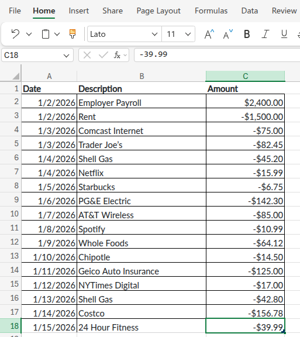

```{r}
#| label: setup-r
#| message: false
#| warning: false
#| include: false
library(tidyverse)
reticulate::py_require(c("numpy", "polars"))
```

```{python}
#| label: setup-py
#| include: false
import polars as pl
import numpy as np
```

## Using Spreadsheets

This section introduces the `r_bank_statement` and `py_bank_statement` datasets and rectangular data in R and Python. It also covers the basics of data manipulation using `tidyverse` in R and `polars` in Python.

::: panel-tabset

## R

Create the `r_bank_statement` dataset using `tibble`:

```{r}
#| label: bank-statement-r
library(tibble)
r_bank_statement <- tibble::tibble(
  Date = as.Date(c(
    "2026-01-02", "2026-01-02", "2026-01-03", "2026-01-03",
    "2026-01-04", "2026-01-04", "2026-01-05", "2026-01-06",
    "2026-01-07", "2026-01-08", "2026-01-09", "2026-01-10",
    "2026-01-11", "2026-01-12", "2026-01-13", "2026-01-14",
    "2026-01-15"
  )),
  Description = c(
    "Employer Payroll",       "Rent",
    "Comcast Internet",       "Trader Joe's",
    "Shell Gas",              "Netflix",
    "Starbucks",              "PG&E Electric",
    "AT&T Wireless",          "Spotify",
    "Whole Foods",            "Chipotle",
    "Geico Auto Insurance",   "NYTimes Digital",
    "Shell Gas",              "Costco",
    "24 Hour Fitness"
  ),
  Amount = c(
     2400.00, -1500.00,
      -75.00,   -82.45,
      -45.20,   -15.99,
       -6.75,  -142.30,
      -85.00,   -10.99,
      -64.12,   -14.50,
     -125.00,   -17.00,
      -42.80,  -156.78,
      -39.99
  )
)
```

## Python 

Create the `py_bank_statement` dataset using `tibble`:

```{python}
#| label: bank-statement-py
import polars as pl

py_bank_statement = pl.DataFrame({
    "Date": [
        "2026-01-02", "2026-01-02", "2026-01-03", "2026-01-03",
        "2026-01-04", "2026-01-04", "2026-01-05", "2026-01-06",
        "2026-01-07", "2026-01-08", "2026-01-09", "2026-01-10",
        "2026-01-11", "2026-01-12", "2026-01-13", "2026-01-14",
        "2026-01-15"
    ],
    "Description": [
        "Employer Payroll",     "Rent",
        "Comcast Internet",     "Trader Joe's",
        "Shell Gas",            "Netflix",
        "Starbucks",            "PG&E Electric",
        "AT&T Wireless",        "Spotify",
        "Whole Foods",          "Chipotle",
        "Geico Auto Insurance", "NYTimes Digital",
        "Shell Gas",            "Costco",
        "24 Hour Fitness"
    ],
    "Amount": [
         2400.00, -1500.00,
          -75.00,   -82.45,
          -45.20,   -15.99,
           -6.75,  -142.30,
          -85.00,   -10.99,
          -64.12,   -14.50,
         -125.00,   -17.00,
          -42.80,  -156.78,
          -39.99
    ]
}).with_columns(pl.col("Date").str.to_date())
```

## Excel 

The `bank_statement` can also be copied + pasted into Excel:

{width="75%" fig-align='center'}


:::

## Math for tracking spending

The future value of contributions formula is:

### The Subscription Audit Math {.unnumbered}

Formula: **Monthly Subscription × 12 × (1.07)^n** = Opportunity cost in n years


